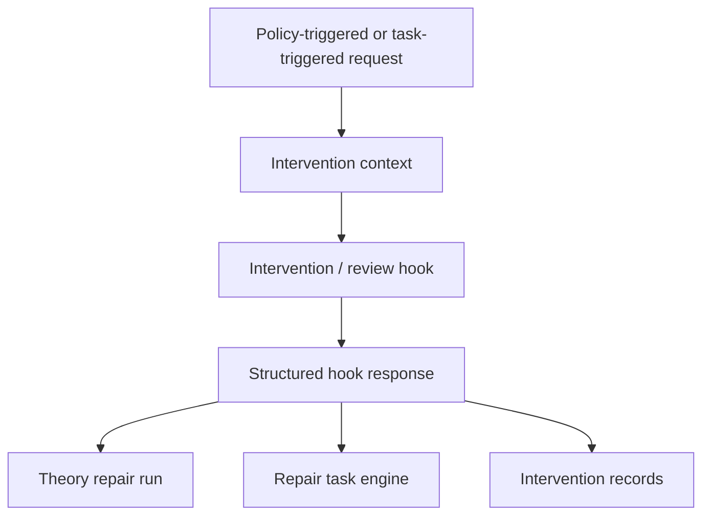

# Intervention And Review Hooks Architecture

Status: Sub-architecture view for intervention / review hooks

Companion documents:

- [`../modules/intervention-and-review-hooks-prd.md`](../modules/intervention-and-review-hooks-prd.md)
- [`../glossary-and-terminology.md`](../glossary-and-terminology.md)
- [`./overview.md`](./overview.md)

## Diagram

## Reading Guide

- Hooks are the explicit external intervention boundary.
- They receive structured intervention context rather than raw runtime state.
- They return bounded response kinds rather than arbitrary imperative commands.
- Hook responses affect either task-level or run-level control flow, but do not
  bypass validation or hard runtime constraints.
