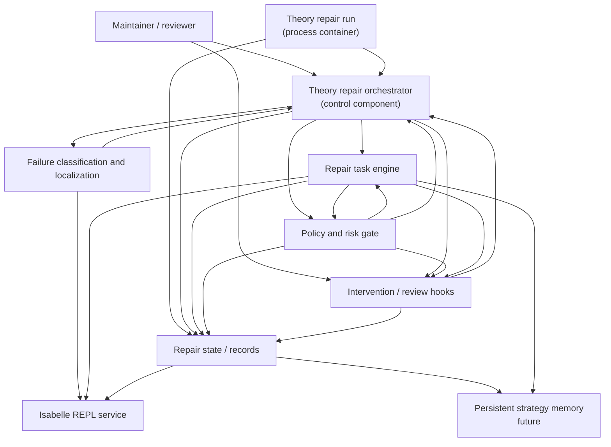

# Proof Repair Architecture Overview

Status: High-level module architecture

Companion documents:

- [`../proof-repair-agent-prd.md`](../proof-repair-agent-prd.md)
- [`../glossary-and-terminology.md`](../glossary-and-terminology.md)
- [`./README.md`](./README.md)

## Purpose

This document is the top-level overview architecture for the proof-repair
system.

It intentionally abstracts away the internal decomposition of individual
modules. In particular:

- the repair task engine appears as one module
- policy and intervention remain separate high-level boundaries
- run-level state and records appear as shared architectural state

Use the module-specific sub-architecture documents when you want to inspect the
internal structure of a specific high-level module.

## Diagram

## Reading Guide

- `theory repair run` is the top-level process container.
- `theory repair orchestrator` is the control component inside that run.
- `failure classification and localization` selects the current repair target
  and its continuation boundary.
- `repair task engine` performs bounded task-local repair over one localized
  repair task block.
- `policy and risk gate` governs risky actions, risky artifact acceptance, and
  risky continuation paths.
- `intervention / review hooks` provide the explicit external review boundary.
- `repair state / records` is a foundational module inside the run container.
- Its v1 scope includes both `working theory snapshot` state and append-oriented
  `run records`.
- `persistent strategy memory` is a future extension rather than a required v1
  dependency.
