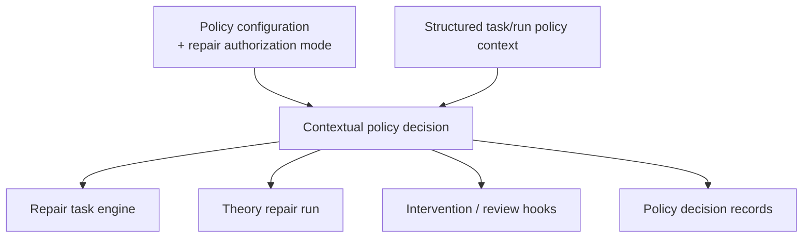

# Policy And Risk Gate Architecture

Status: Sub-architecture view for policy and risk gating

Companion documents:

- [`../modules/policy-and-risk-gate-prd.md`](../modules/policy-and-risk-gate-prd.md)
- [`../glossary-and-terminology.md`](../glossary-and-terminology.md)
- [`./overview.md`](./overview.md)

## Diagram

## Reading Guide

- Policy is a separate gate layer rather than a search controller.
- V1 policy is rule-based and context-sensitive.
- Policy consumes structured context from runtime and orchestrator rather than
  grabbing internal state directly.
- Important policy outcomes become policy decision records.
