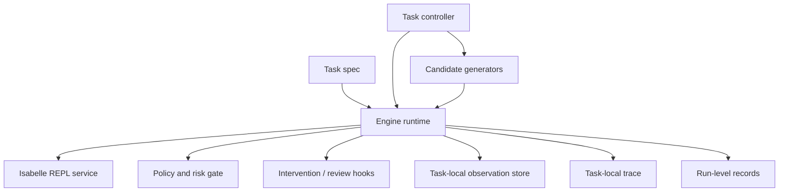

# Repair Task Engine Architecture

Status: Sub-architecture view for the repair task engine

Companion documents:

- [`../modules/repair-task-engine-prd.md`](../modules/repair-task-engine-prd.md)
- [`../glossary-and-terminology.md`](../glossary-and-terminology.md)
- [`./overview.md`](./overview.md)

## Diagram

## Reading Guide

- `engine runtime` owns task-local execution semantics.
- `task controller` chooses the next action but does not own policy or
  top-level continuation.
- `candidate generators` are proposal backends invoked through runtime-mediated
  actions.
- Task-local observation and trace stay inside the task path and only selected
  events are promoted to run-level records.
