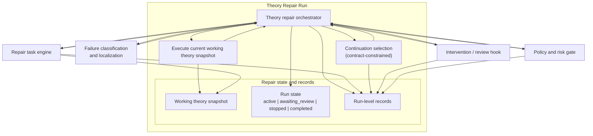

# Theory Repair Run Architecture

Status: Sub-architecture view for the top-level run

Companion documents:

- [`../modules/theory-repair-run-prd.md`](../modules/theory-repair-run-prd.md)
- [`../glossary-and-terminology.md`](../glossary-and-terminology.md)
- [`./overview.md`](./overview.md)

## Diagram

## Reading Guide

- `theory repair run` is the process container.
- `theory repair orchestrator` is the controlling component inside that run.
- `repair state and records` is modeled as a foundational module inside the run
  container rather than as an external utility.
- This foundational module contains:
  - `working theory snapshot` (execution substrate and mutable repaired text
    state)
  - `run-level records` and `run state` (auditable process model)
- Classification/localization, task engine, policy, and hooks are peer modules
  invoked by orchestrator rather than orchestrator internals.
- Continuation remains constrained by block-contract semantics.
- Intervention / review pauses run progression via `awaiting_review` state rather
  than as a continuation kind.
- Run-level records remain separate from task-local trace.
