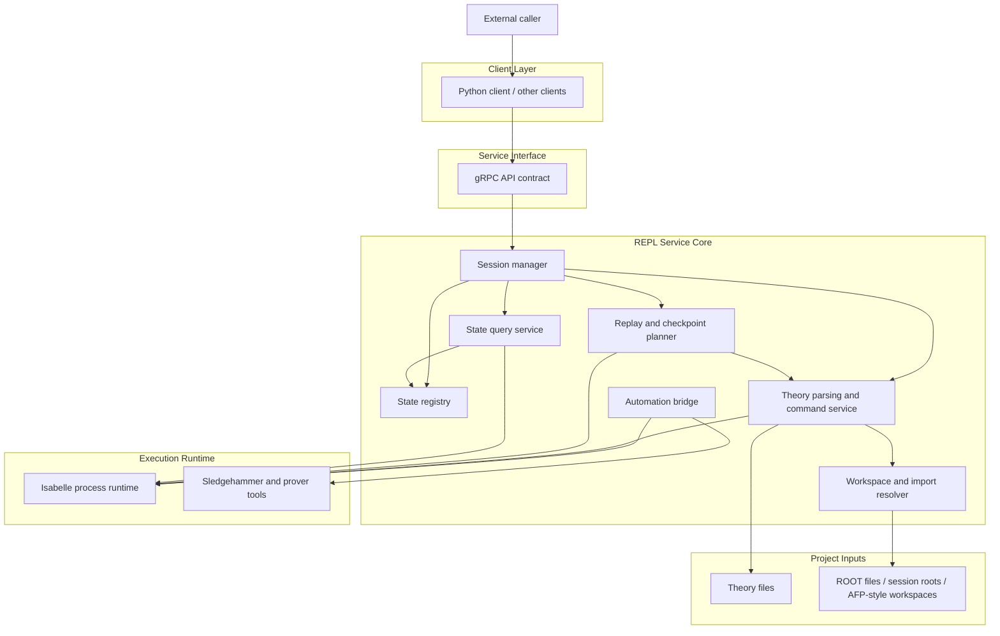

# Isabelle REPL Architecture

This diagram focuses on the architecture of `isabelle-repl` itself.

It intentionally stays at the component level:

- no code-level snippets
- no file-by-file structure
- no proof-repair-specific orchestration logic

## Reading guide

The main architectural idea is that `isabelle-repl` acts as a stateful REPL
service on top of Isabelle:

- clients talk to a stable RPC boundary
- the service manages long-lived Isabelle sessions
- proof states evolve non-destructively and are tracked through state IDs
- theory loading, replay, querying, and optional automation are exposed as
  reusable primitives

In other words, `isabelle-repl` is the substrate that higher-level tools can
build on, rather than a proof-repair system by itself.
